# ugplot

ugPlot is an interactive Shiny workbench for discovering, ranking, and comparing transcript-level signals in omics and biomedical datasets.

Its central GEO methylation workflow starts with CpG-level evidence, groups CpGs by transcript, builds transcript-specific machine learning datasets, trains models for each transcript group, and orders transcripts by how well their methylation pattern predicts a chosen target such as age, disease severity, treatment response, exposure, intake, or another measurable phenotype.

That transcript order is the key output. When the same target is evaluated across multiple clinical or biological groups, ugPlot lets you compare how transcript rankings change between those groups. A transcript that moves strongly up or down in prediction rank is not a final biological conclusion by itself, but it is a focused hypothesis: the relationship between methylation in that transcript region and the selected target may be altered in that group and may deserve deeper study.

ugPlot also provides the supporting workbench needed to make those comparisons reproducible: load and clean matrix-like datasets, explore patterns visually, train and compare machine learning models, analyze saved models on new data, and run long GEO jobs on a remote server while monitoring progress in the browser.

Preprint DOI: https://doi.org/10.64898/2026.02.09.704870

---

## Core idea

Many omics workflows ask whether a feature is associated with a phenotype. ugPlot extends that question to transcript-level prediction and comparison:

1. Choose a target that can be predicted or correlated, such as age, severity, response, dose, exposure, or another phenotype.
2. Find CpGs associated with that target and group them by transcript.
3. Train transcript-level ML models and rank transcript groups by prediction strength and stability.
4. If a class/group column is available, compare the transcript ranking across groups.
5. Use rank shifts, CpG-level methylation changes, and ML importance plots to decide which transcript regions are worth follow-up.

In practice, ugPlot is useful when the biological question is not only "which CpGs correlate with my target?", but also "which transcript regions predict the target best, and does that predictive behavior change between groups?"

## Installation

### 1) Recommended (main) installation: prebuilt Podman image

This is the easiest and most reliable way to run ugPlot with all dependencies already configured.

```bash
podman pull ghcr.io/a00s/ugplot:latest
podman run --name ugplot -p 3838:3838 ghcr.io/a00s/ugplot:latest
podman start -a ugplot

---- you are using mac you need to run this first ----
podman machine init
podman machine start
```

Then open in your browser:

- `http://127.0.0.1:3838`

> Why this is the main path: it avoids local R/system library conflicts and is ideal for users who just want to run the app quickly.

### 2) Alternative installation from R (for users who need package-level imports/workflows)

Use this when you want to integrate ugPlot into your own R environment and scripts.

```r
install.packages(
  "ugplot",
  repos = c("https://a00s.r-universe.dev", "https://cloud.r-project.org")
)
```

Run in R:

```r
library(ugplot)
ugPlot()
```

### 3) Running a remote job server

Use this when you want the Shiny app on one machine and the model training jobs on another machine, or when you want long jobs to keep running outside the browser session.

Run these commands on the server machine:

```r
library(ugplot)

# Install the packages needed by the HTTP job server.
ugPlotInstallServerDeps()

# Optional: inspect caret model dependencies available on this server.
ugPlotCheckModelDeps()

# Optional: install packages for every caret model that is missing dependencies.
# This can install many R packages, so run it on the server before starting jobs.
ugPlotInstallModelDeps()

# One-command server setup including model dependencies:
# ugPlotInstallServerDeps(install_model_deps = TRUE)

ugPlotServerStart(
  host = "0.0.0.0",
  port = 8080,
  token = "use-a-long-random-secret"
)
```

For internet-facing servers, put port 8080 behind an HTTPS reverse proxy or a
private VPN and block direct public access to the port. Bearer tokens sent over
plain HTTP are not encrypted. Restrict SSH to keys and trusted source networks.

Manage the background server from R:

```r
ugPlotServerStatus()
ugPlotServerStop()
```

For a Linux server that runs ugPlot from a Git checkout, the repository includes
a restart helper:

```bash
scripts/linux-restart-from-git.sh 'your-token'
```

Optional environment variables:

```bash
UGPLOT_BRANCH=main
UGPLOT_HOST=0.0.0.0
UGPLOT_PORT=8080
UGPLOT_HEALTH_HOST=127.0.0.1
UGPLOT_SERVER_TOKEN=your-token
```

The script stops the running ugPlot server, pulls the selected branch with
`--ff-only`, installs the local package, starts the server again, and checks
`/health`. Keep the token outside the repository. Passing the token as an
environment variable avoids saving it in shell history.

Then, in the ugPlot app:

1. Open **CONFIGURATIONS**.
2. Add the protected server URL, preferably an HTTPS reverse-proxy URL.
3. Add the same token used in `ugPlotServerStart()`.
4. In **MACHINE LEARNING**, choose **Run target → Remote server**.
5. Submit the job and monitor it in **JOBS**.
---

# How-To Manual

## What ugPlot is best for

Use ugPlot when you need to:

1. Turn GEO methylation accessions into CpG, transcript, and transcript-ML reports.
2. Rank transcript groups by how well their CpG patterns predict a selected target.
3. Compare transcript rankings across biological or clinical groups.
4. Detect transcript groups whose predictive behavior changes between groups.
5. Inspect CpG-level methylation shifts and ML importance inside a selected transcript.
6. Load a matrix-like dataset (samples × features), clean it, and explore structure visually.
7. Train many caret models, compare metrics, save models, and validate predictions reproducibly.

The app is most useful when the analysis is still exploratory but needs to remain reproducible. In a GEO methylation study, a typical session starts with a public accession, chooses a phenotype target, finds CpGs associated with that target, groups CpGs by transcript, screens transcript-level ML models, stabilizes the best model per transcript, and then asks whether transcript rank changes between groups. In a general tabular workflow, a session starts with a matrix, narrows it to the samples/features that make biological or clinical sense, checks whether visible structure exists, and only then runs machine learning.

Treat ugPlot as a guided workbench: each tab helps answer a specific question before moving to the next one. The most common mistake is to jump directly to ML. If row/sample labels, missing values, categories, matrix orientation, target choice, or comparison groups are wrong, a model can still train but answer the wrong question. Use the early tabs and GEO pipeline cards to make the dataset explicit before trusting any downstream metric.

---

## 0) Interface overview

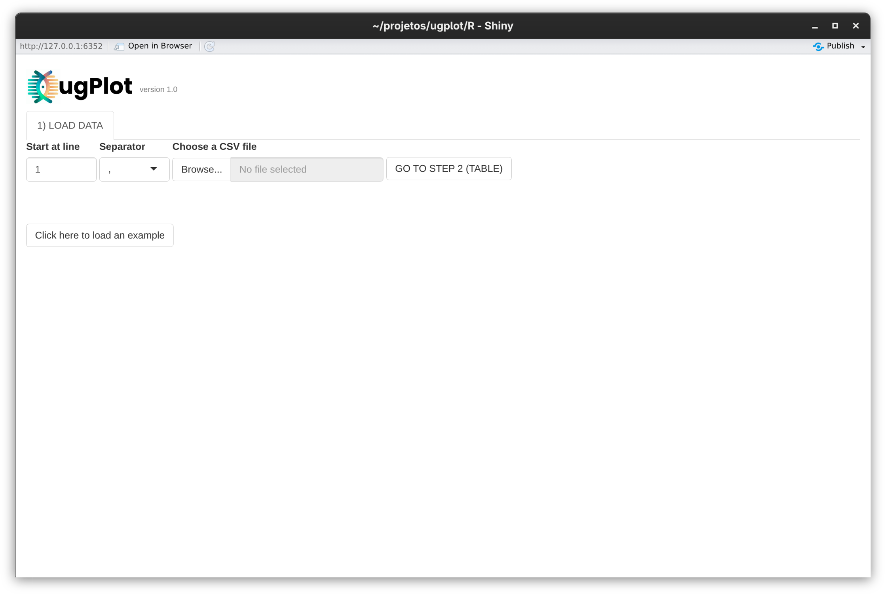

The workflow is linear:

1. **LOAD DATA**
2. **TABLE**
3. **HEATMAP PLOT**
4. **2D PLOT**
5. **MACHINE LEARNING**
6. **MODEL ANALYSIS**
7. **DEEP LEARNING**

A practical recommendation: always finish row/column cleanup in **TABLE** before training models.

Think of the tabs as checkpoints:

- **LOAD DATA** answers: "Did ugPlot read my file correctly?"
- **TABLE** answers: "Which samples and variables are really part of this analysis?"
- **HEATMAP / 2D PLOT / GRAPH MODELS** answer: "Is there structure worth modeling, and are there obvious artifacts?"
- **MACHINE LEARNING** answers: "Can the selected variables predict my target robustly?"
- **MODEL ANALYSIS** answers: "Does a saved model behave sensibly on this dataset?"
- **GEO IMPORT** answers: "Can a public methylation accession be turned into CpG/transcript-level hypotheses?"

The **CITE UGPLOT** button in the top-right header copies the preprint DOI, confirms the action inside the app, and also tries to open the preprint in a new browser window. If the browser blocks the new window, the DOI remains copied and can be pasted manually.

---

## 1) LOAD DATA — bring your dataset correctly

### 1.1 Choose file format settings first

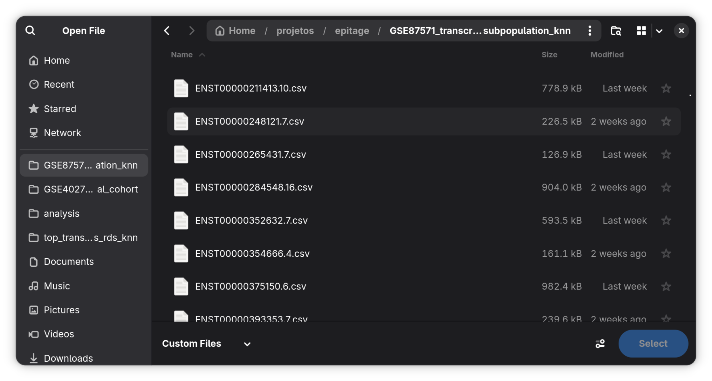

- **Start at line**: if your file has metadata in first lines, start later (e.g., 2, 3, 4...).
- **Separator**: pick the true delimiter of your file (`;`, `,`, tab, etc.).
- **Choose a CSV file**: upload your file.

If separator/line start is wrong, downstream columns may be broken. Fix this here before moving on.

Before continuing, quickly scan the preview and ask:

- Are samples and features in the expected orientation?
- Did the header become real column names rather than a data row?
- Are decimal values split correctly, or did the wrong separator merge columns?
- Are metadata columns mixed with numeric features, and should they later be marked as categories?

If any answer looks wrong, fix it here. Later tabs assume the imported table shape is intentional.

### 1.2 Confirm detected columns and rows

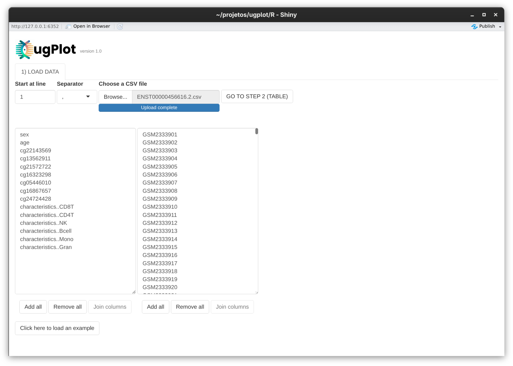

After upload, ugPlot shows:

- Left box: detected **columns/features**.
- Right box: detected **rows/samples**.

Buttons below each box:

- **Add all**: include everything.
- **Remove all**: clear all selections.
- **Join columns**: normalize text list into a merged selection.

Then click **Continue to table**.

If you just want to test the app first, click **Explore example dataset**.

For most biomedical tables, include all columns/samples at first, then remove or mark items in **TABLE**. Starting broad keeps the original context visible while you decide what belongs in the final analysis.

---

## 2) TABLE — the most important preprocessing page

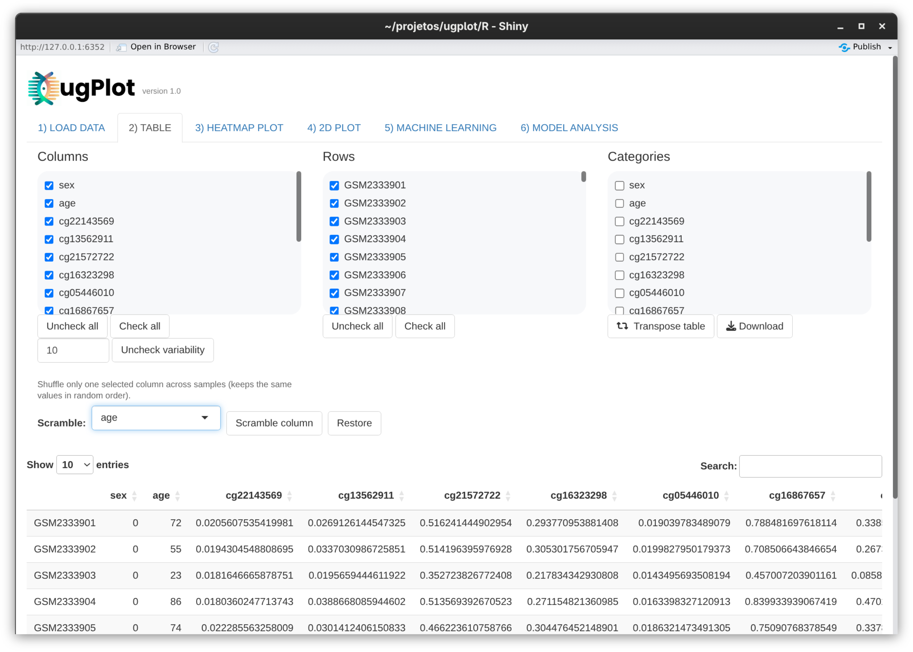

Think of this tab as your "quality gate" before plotting/training.

Use this page slowly. The goal is not only to remove bad data, but to define the study design inside the app: which rows are cases/controls, which columns are predictors, which columns are labels, and which values should be considered missing. A clean TABLE setup makes plots easier to interpret and ML results much less ambiguous.

### 2.1 Columns panel (features)

- Checkboxes let you keep/remove features.
- **Uncheck all / Check all**: bulk operations.
- **Uncheck variability** with numeric threshold:
  - removes low-information columns.
  - useful to reduce noisy/near-constant features.
- **Scramble column**:
  - selects one feature and randomizes it across samples,
  - useful for quick sanity checks / negative controls.
- **Restore** reverts scrambled data.

When to remove columns:

- remove near-constant variables because they usually add noise rather than signal,
- remove identifiers that encode sample names or batch labels unless you explicitly want to model them,
- keep biological/clinical variables that are plausible predictors,
- mark outcome/group columns as categories instead of leaving them among numeric predictors.

Use **Scramble column** as a sanity check: if scrambling a key feature does not change performance later, the model may not have been using that feature meaningfully.

### 2.2 Rows panel (samples)

- Select only the samples you want to keep.
- Use **Uncheck all / Check all** for fast cohort filtering.

Rows are samples. Remove samples when they are outside the comparison you want to make, have unresolved quality issues, or belong to a cohort that would answer a different question. If the dataset mixes discovery/validation cohorts, first analyze them separately unless your goal is explicitly cross-cohort robustness.

### 2.3 Categories panel

- Select columns that should behave like category/annotation fields.
- **Transpose table** swaps rows/columns (useful when dataset orientation is opposite of expected).
- **Download** exports exactly what is currently selected.

Categories should be used for labels, groups, batches, and phenotype descriptors. A category column can be useful for coloring plots, splitting comparisons, or selecting ML targets. Do not treat sample IDs, free-text notes, or high-cardinality identifiers as ordinary predictors unless you have a specific reason.

### 2.4 Bottom data table

Use search/sort to inspect suspicious values before plotting or ML.

This is the best place to catch practical problems: hidden missing values, unexpected zeros, duplicated samples, impossible ages, mixed units, and class imbalance. If a value looks suspicious in the table, fix the inclusion/missingness decision before interpreting downstream figures.

---

## 3) HEATMAP PLOT — fast visual diagnostics + editable code

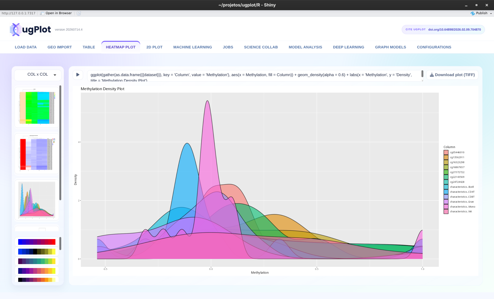

Use heatmaps early, before ML, to see whether the dataset has broad structure. A useful heatmap can reveal sample clusters, batch effects, outliers, and groups of correlated variables. A confusing heatmap is also informative: it may mean the selected features are too noisy, too many, or not scaled/filtered appropriately.

- **plot_xy** controls matrix orientation (`ROW x COL`, `COL x COL`, `ROW x ROW`).
- Left gallery (large images): choose plot template.
- Palette strips: choose color scheme.
- Top code area:
  - **Play button** runs the displayed plotting code.
  - editable code box allows fine customization.

Best practice: choose a template close to your goal, then refine code in the text area.

Interpret heatmaps qualitatively. They are not proof of prediction performance, but they are excellent for deciding whether the dataset is ready for modeling or still needs filtering. If one row or column dominates the color scale, inspect it in TABLE before moving on.

---

## 4) 2D PLOT — discover pairwise relationships

### 4.1 Correlation filtering

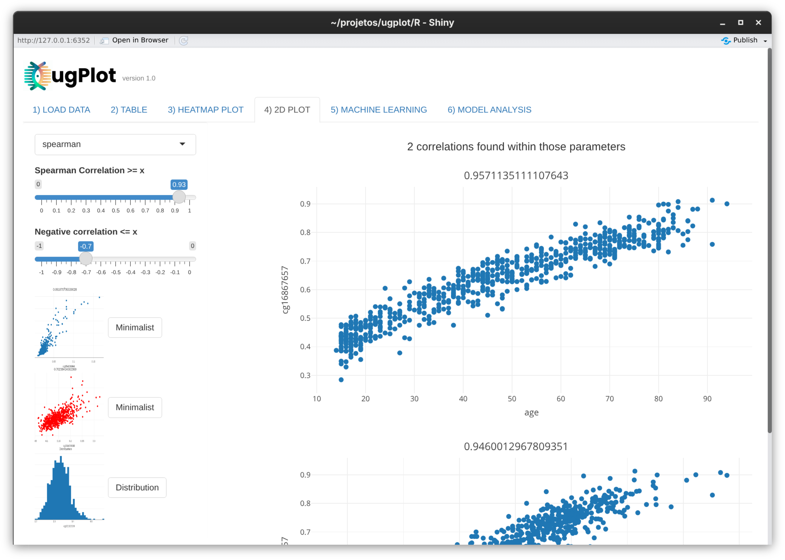

Use 2D plots when you want to understand pairwise relationships rather than global structure. They are especially useful for spotting a small number of strong feature-target relationships, checking whether correlations are linear, and finding outliers that drive an apparent association.

- Correlation method: `pearson`, `spearman`, `kendall`.
- Positive threshold slider (`>= x`).
- Negative threshold slider (`<= x`).
- Left mini-buttons:
  - **Minimalist** for scatter-style quick reading.
  - **Distribution** for histogram-like views.

Main panel displays only pairs that pass your thresholds.

Choose the correlation method based on the question:

- **Pearson** is best for approximately linear numeric relationships.
- **Spearman** is better when the relationship is monotonic but not linear, or when ranks are more reliable than raw values.
- **Kendall** is conservative and useful for smaller datasets or many tied values.

If a strong correlation appears only because of one or two extreme samples, do not treat it as stable evidence until you inspect those samples.

### 4.2 Distribution mode example

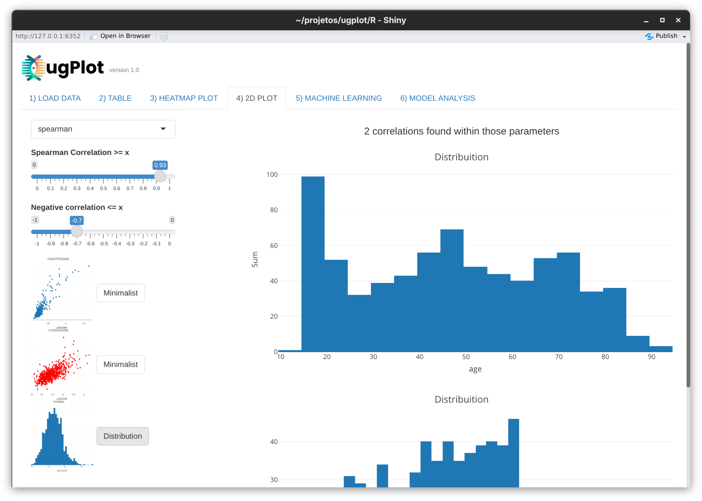

Use distribution mode to check whether correlations may be driven by skewed ranges/outliers.

Distribution mode is also useful before ML because a target with extreme imbalance or heavy skew can make standard train/test metrics misleading. If the target distribution is poor, consider filtering, transforming, or explicitly treating the task as classification/regression before training.

---

## 5) MACHINE LEARNING — train, compare, and troubleshoot models

### 5.1 Core setup

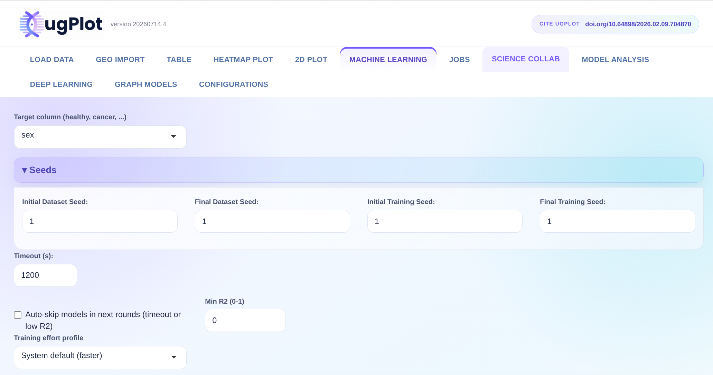

Use MACHINE LEARNING only after the dataset shape is settled. The main question here is not "which model wins once?", but "does any model perform consistently enough to justify further investigation?"

- **Target column**: variable to predict (class or numeric).
- **Seeds** section:
  - initial/final dataset seed,
  - initial/final training seed,
  - supports repeatability and robustness checks.
- **Timeout (s)** controls maximum training time.
- **Auto-skip models in next rounds** avoids repeating models that time out or remain below the selected quality threshold.
- **Min R2 (0-1)** defines the minimum R² used by auto-skip for regression runs.
- **Training effort profile** lets you choose between the faster system default and more intensive training profiles when available.

For small exploratory runs, use fewer models or shorter timeouts to check that the setup works. For a result you plan to report, run multiple seeds and prefer models whose performance remains stable. A single high score from one split can be luck, leakage, or class imbalance.

### 5.2 Missing data strategy (critical for robust models)

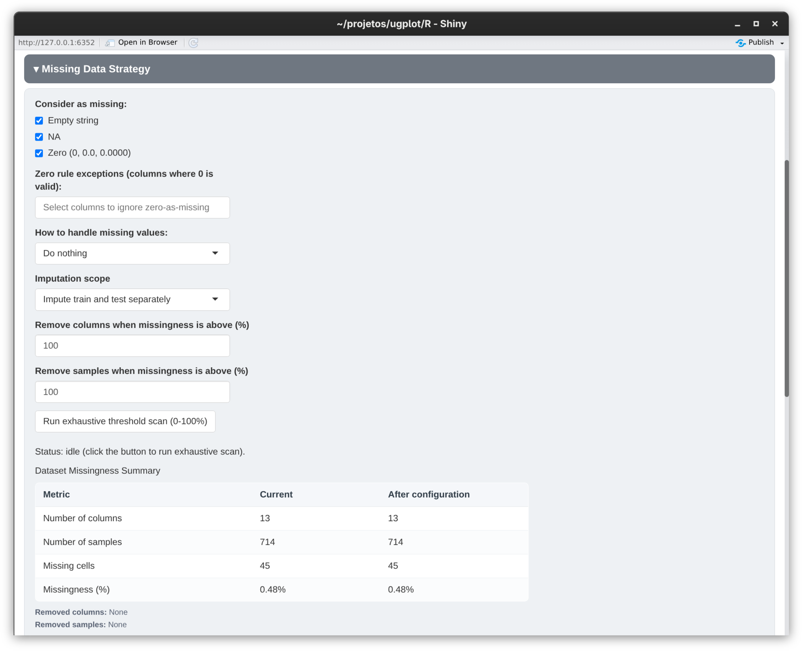

You can define what missing means and how to process it:

- Missing definitions: Empty string, `NA`, and/or zero.
- **Zero rule exceptions** for columns where zero is valid.
- Imputation method:
  - none,
  - replace zero,
  - KNN,
  - mean,
  - missForest,
  - methyLImp2.
- Imputation scope:
  - train/test separately,
  - or whole dataset before split.
- Missingness thresholds to remove columns/samples.
- **Run exhaustive threshold scan (0-100%)** to test many threshold combinations automatically.

Read the summary table/plots before running models, to confirm filtering did not distort target distribution.

Missingness choices change the question being modeled. Removing many samples may produce a cleaner dataset but can also bias the cohort. Imputing values keeps sample size but may add artificial signal. Use the missingness summary to check whether one class or group is being removed more aggressively than another.

Zero deserves special attention. In some omics matrices zero means "not detected"; in others it is a real measured value. Use zero exceptions for columns where zero is biologically or technically valid.

### 5.3 Installing missing model libraries (step-by-step)

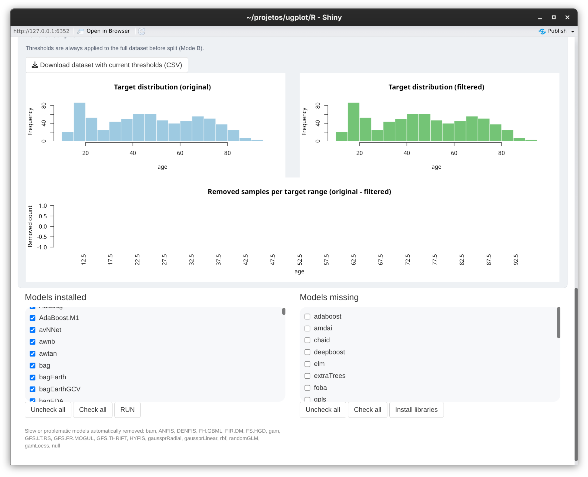

When models appear in **Models missing**, do this:

1. In **Models missing**, click **Check all** (or select specific models).
2. Click **Install libraries**.
3. Wait for installation logs to finish.
4. Re-check the model lists; installed models should move to **Models installed**.
5. In **Models installed**, click **Check all** (or keep a subset).
6. Click **RUN**.

Also available on this page:

- **Download dataset with current thresholds (CSV)** for reproducibility.
- Side-by-side panels for installed vs missing models.

For a remote ugPlot server, install the missing model libraries on the server machine, not only in the R session running the browser app:

```r
ugPlotCheckModelDeps()
ugPlotInstallModelDeps()
```

If you are comparing many models, treat this phase as screening rather than final inference. Different caret models have different dependency packages, tuning grids, and failure modes. It is normal for some models to fail or time out; the important part is whether enough suitable models finish to compare stable performance.

### 5.4 Remote jobs and loading results

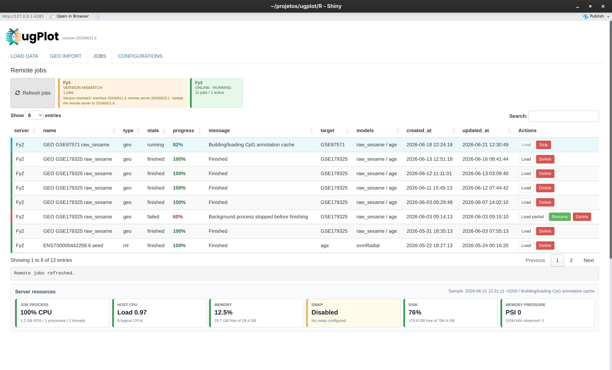

Use **JOBS** to monitor model runs submitted to local or remote ugPlot servers.

Use remote jobs when the work is long, memory-heavy, or should continue even if the browser closes. This is especially important for large GEO methylation workflows and many-model ML screening. The local interface should be treated as the control panel; the remote server is where the heavy computation lives.

- Server cards summarize connection state, active jobs, and version mismatches.
- The job table shows server, job name, type, state, progress, target, model list, timestamps, and actions.
- Selecting a job row only refreshes its status, resource telemetry, and log. It does not load the result or change tabs.
- **Load** imports a finished result back into the app. **Load partial** explicitly opens the latest checkpoint from a failed or stopped job.
- **Resume** continues a recoverable failed or stopped job from its saved checkpoint.
- **Stop** asks a running remote server to stop the active job.
- **Delete** removes finished job records when they are no longer needed.

The **Server resources** panel is sampled every 30 seconds while a job is active. It reports the job process CPU and RSS, host load, available memory, swap, disk usage, Linux memory pressure (PSI), and observed OOM kills. Green cards are within normal limits, yellow cards need attention, and red cards indicate critical pressure or an OOM event. `Swap: Disabled` means the server has no swap configured; it does not mean swap usage is zero on an available swap device. For a stopped process, the first card shows the last live process sample rather than a current CPU value.

For remote GEO jobs, selecting the running job also shows a visual **GEO job progress** report. This separates coarse pipeline stage progress from the long stability-seed phase, so a job that is near the final stage does not look falsely complete. Completed steps are green, the active step is blue, and pending steps are gray.

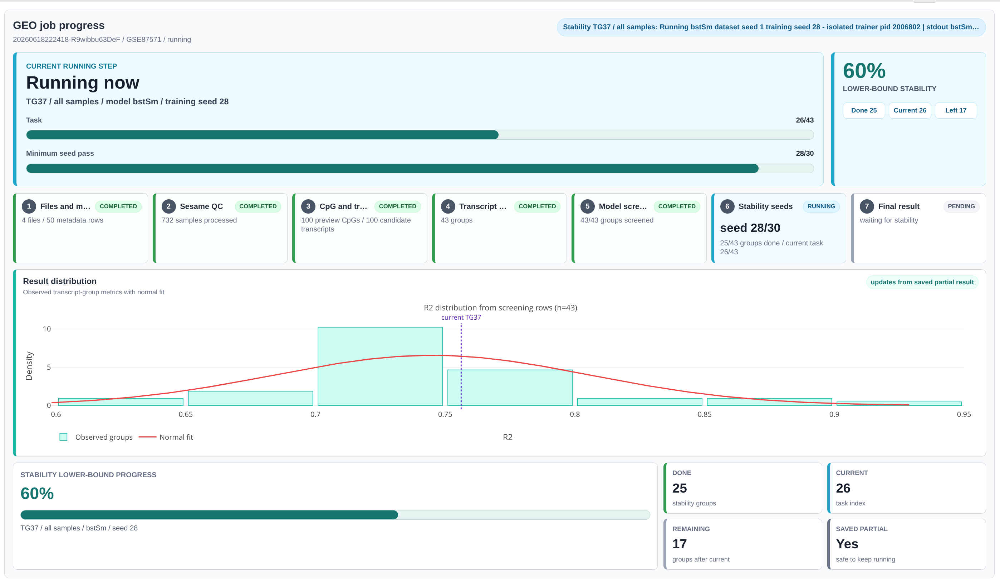

The stability bar is a lower-bound estimate based on the saved partial result and the currently running transcript group. It reports how many transcript groups are done, which task is active, how many groups remain, and whether a partial checkpoint is available. Transcript group IDs can move from higher numbers to lower numbers because the stability queue follows the screening `CombinedRank`, not numeric TG order.

If a server card shows **VERSION MISMATCH**, update the remote server package so the interface and server use the same ugPlot version.

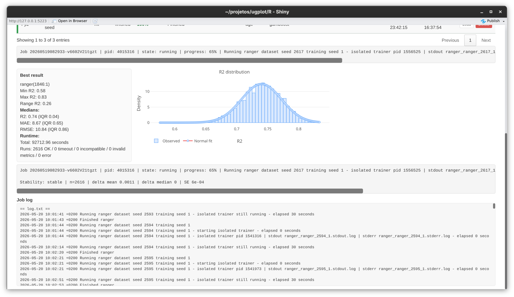

After loading a job result, ugPlot displays the best-result summary, metric distribution, stability information, and job logs. For multi-seed jobs, prefer the median and interquartile range over the best single seed when reporting model performance.

#### Live discovery report

While a GEO job is running, click **Live report** in its **JOBS** row. You can also open the report directly:

```text
http://YOUR-SERVER:8080/reports/JOB-ID
```

The page is public and refreshes automatically. As soon as a transcript group and CpG are known, a gray **awaiting analysis** row appears. Orange **preliminary** rows have completed model screening, and green **stabilized** rows have completed the configured seed stability analysis. Use the search field to find a gene, transcript, CpG, model, or transcript group.

The job is selected exclusively by the report URL; there is no server or job selector inside the report. A report opened on Fy2 therefore belongs only to Fy2 and cannot redirect to another ugPlot server. ugPlot maintains a small static JSON snapshot inside the job directory and updates it as discoveries emerge, so visitors do not trigger a reconstruction of the analysis. Use the ordering control to rank the table by the best ML R2 or the strongest absolute CpG correlation.

### 5.5 Interpreting output

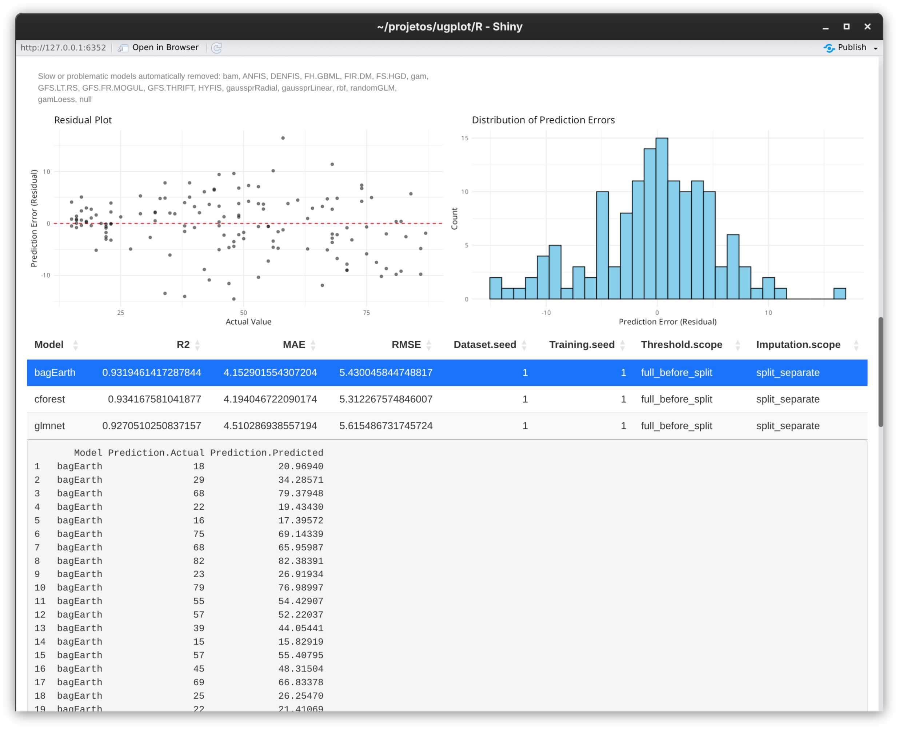

After running:

- residual plot: checks error structure,
- residual histogram: checks bias spread,
- ranking table: compare `R2`, `MAE`, `RMSE`,
- detailed prediction table per selected model.

Tip: prefer models with stable performance across seed combinations, not only best single score.

For regression, check `R2`, `RMSE`, and residual plots together. A high `R2` with structured residuals can still mean the model is biased in part of the range. For classification, inspect class-specific performance and confidence; a good global accuracy can hide poor detection of the minority class.

If results look too good, check for leakage: target-derived columns, sample IDs, batch columns that encode outcome, duplicated rows, or preprocessing performed before train/test split.

---

## 6) MODEL ANALYSIS — validate saved `.rds` models

### 6.1 Initial setup

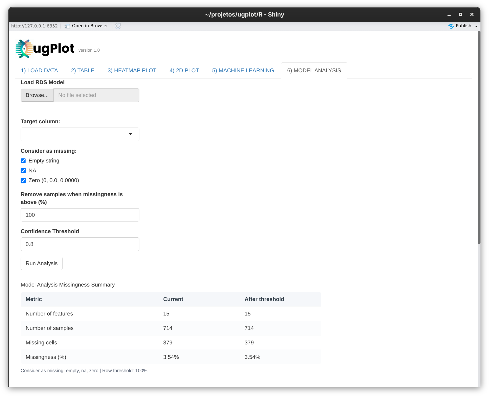

- Upload model with **Load RDS Model**.
- Select dataset **Target column** (ground truth).
- Configure missingness definition + sample threshold.
- Set **Confidence Threshold**.
- Click **Run Analysis**.

Use MODEL ANALYSIS when the model already exists and the question is validation rather than training. This is useful for checking whether a saved `.rds` model can be applied to a new dataset, whether required predictors are present, and whether predictions remain reliable outside the training context.

### 6.2 Model metadata view

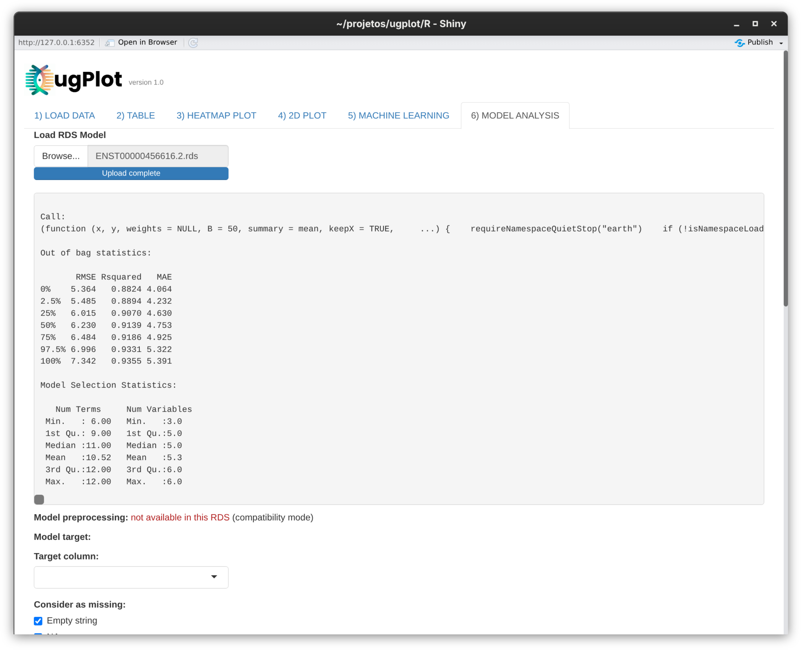

ugPlot displays model call/statistics, compatibility/preprocess notes, and inferred target details when available.

Read this metadata before trusting predictions. If the new dataset is missing predictors, uses different column names, or has incompatible preprocessing assumptions, performance estimates may not be comparable to the original training run.

### 6.3 Summary and reliability report

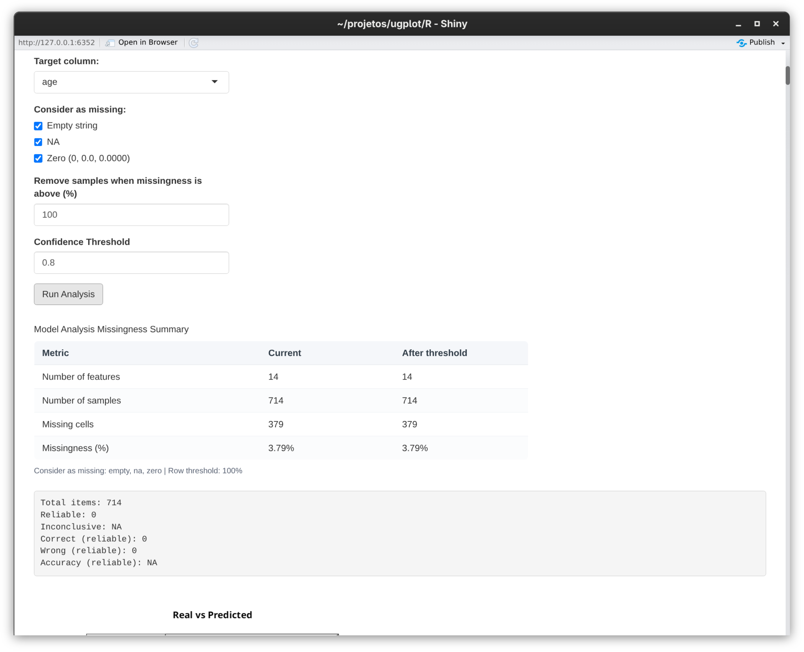

Inspect:

- missingness before/after threshold,
- reliable/inconclusive counts,
- accuracy summary in reliable subset.

The reliability report separates "can make a confident prediction" from "made a prediction for every row." This distinction matters when a model is only reliable for part of the dataset. A smaller reliable subset with transparent criteria is often more useful than pretending every prediction has the same quality.

### 6.4 Final outputs and export

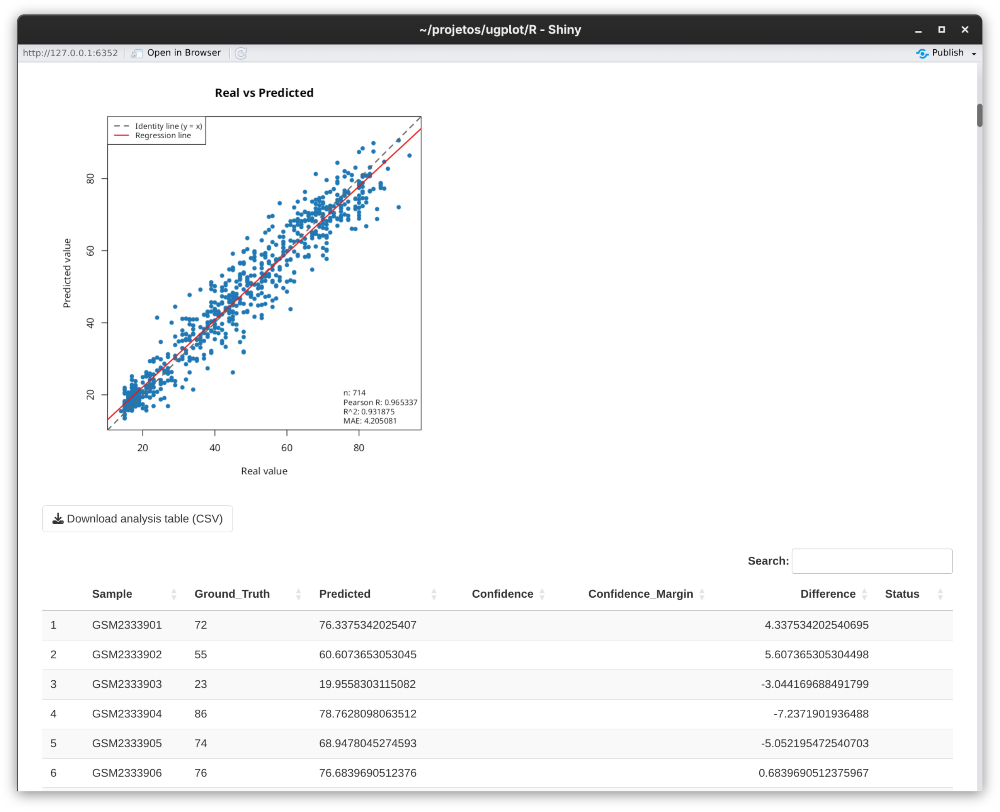

- Real vs Predicted scatter (identity + regression lines).
- Correlation/performance stats overlay.
- **Download analysis table (CSV)** for downstream reporting.
- Per-sample table with truth, prediction, confidence, error, and status.

Use the per-sample table to investigate failures. Sort by error or low confidence, then look for patterns: one cohort failing, one class consistently confused, or samples with many missing predictors.

---

## 7) DEEP LEARNING — train neural networks with `torch`

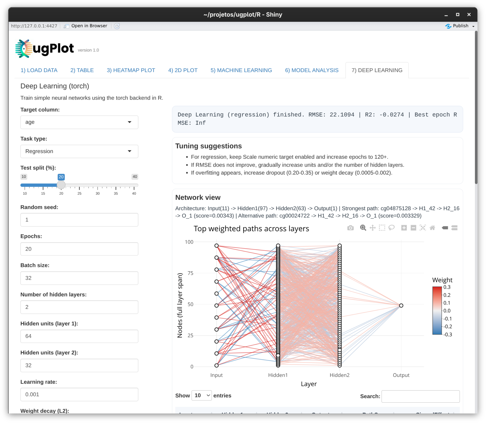

Use this tab when you want a configurable neural network pipeline directly inside ugPlot.

Deep learning is not automatically better than caret models. Use it when you have enough samples/features to justify a flexible model, when simpler models underfit, or when you want to test whether a neural network can discover interactions missed by classical methods. For small biomedical tables, deep learning can overfit quickly, so start conservatively.

### 7.1 Training configuration (left panel)

- **Target column**: variable to predict.
- **Task type**:
  - **Auto-detect** (recommended): ugPlot infers classification vs regression.
  - **Classification** or **Regression**: force task mode manually.
- **Test split (%)**: holdout size for evaluation.
- **Random seed**: reproducibility for split/training.
- **Epochs** and **Batch size**: training duration and update granularity.
- **Number of hidden layers** + hidden units/dropout controls:
  - define model depth/width,
  - tune regularization to reduce overfitting.
- **Learning rate** and **Weight decay (L2)**: optimizer stability + regularization.
- **Scale numeric target (regression)**: stabilizes regression training for wide target ranges.
- **Auto adjust hidden layer sizes**: quickly generates a reasonable architecture from feature count.
- **Train Deep Learning model**: starts the full preprocessing + training + evaluation cycle.

A practical starting point is a small number of hidden layers, moderate dropout, and enough epochs to see whether train and test loss separate. If train loss improves but test loss worsens, reduce model size, increase dropout, or stop earlier.

### 7.2 Outputs and diagnostics (right panel)

After training, ugPlot shows:

- **Training log** with preprocessing/training status messages.
- **Loss curves** (train vs test) across epochs.
- **Metric panel** with task-relevant performance indicators.
- **Tuning tips** to help diagnose underfitting/overfitting.
- **Network view**:
  - model shape summary,
  - path/connection visualization,
  - path weight table,
  - weight distribution plot.
- **Metrics table** and **Predictions table** for per-run and per-sample inspection.

Practical tip: start with auto architecture + moderate epochs, then tune hidden units/dropout and learning rate based on loss gap and prediction quality.

Use the network view as a diagnostic, not as biological proof. Strong weights or paths suggest what the neural network used, but they still need validation against simpler models, feature correlations, and domain knowledge.

---

## 8) GRAPH MODELS — visualize feature correlation networks

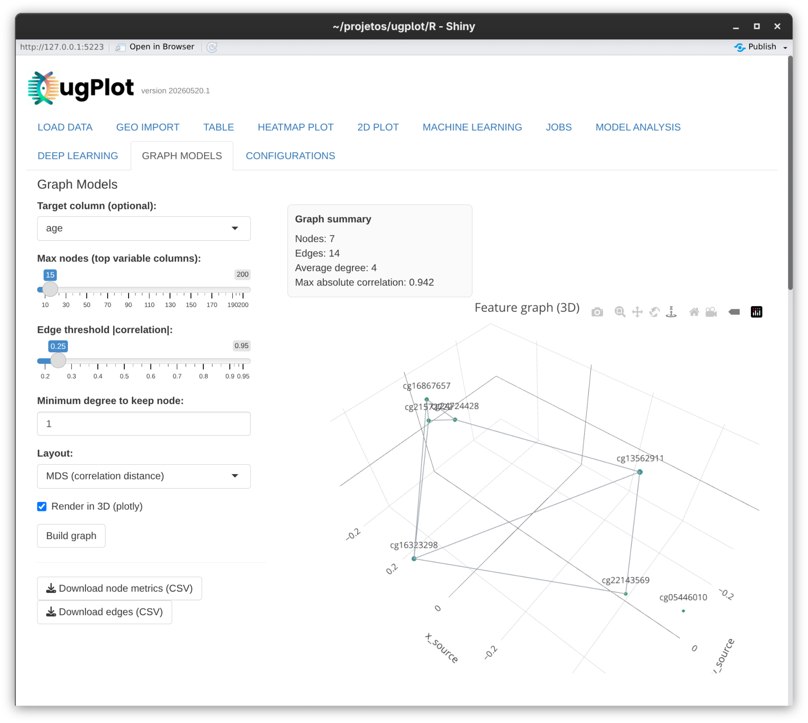

Use **GRAPH MODELS** when you want to inspect how selected variables relate to each other as a correlation network.

Graph models are useful when individual pairwise plots are too fragmented and you want to see whether variables form communities. They help identify feature groups that move together, potential redundant predictors, and hub variables that may dominate downstream models.

- **Target column (optional)** can keep the outcome visible while selecting features.
- **Max nodes** limits the graph to the most variable columns, preventing unreadable dense networks.
- **Edge threshold |correlation|** controls how strong a relationship must be before an edge is drawn.
- **Minimum degree** removes isolated or weakly connected nodes.
- **Layout** changes how nodes are positioned.
- **Render in 3D (plotly)** enables interactive rotation/zoom for spatial inspection.

The graph summary reports the number of nodes, edges, average degree, and maximum absolute correlation. Use these values as a quick density check before interpreting individual edges.

If the graph is too dense, raise the edge threshold or lower max nodes. If it is nearly empty, lower the threshold or include more variables. Avoid interpreting every edge individually; first look for robust clusters and then inspect representative variables in 2D plots or TABLE.

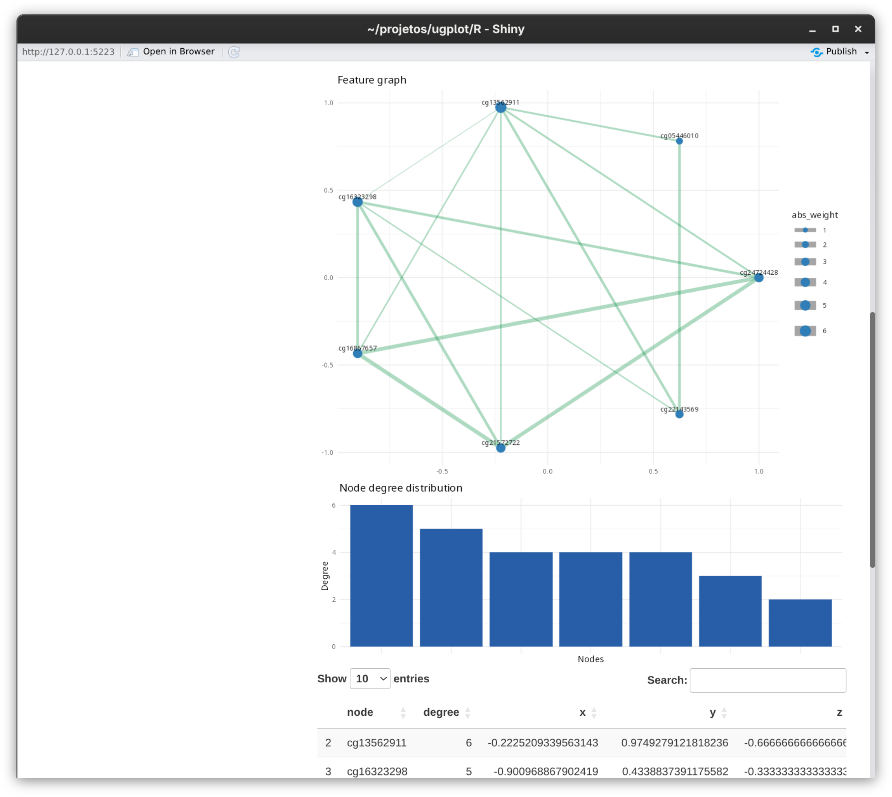

When 3D rendering is disabled or when reviewing static output, ugPlot shows a 2D feature graph, node degree distribution, and node metrics table. The download buttons export node metrics and edge lists as CSV files for external network analysis or figure preparation.

---

## 9) GEO IMPORT — methylation pipeline tutorial

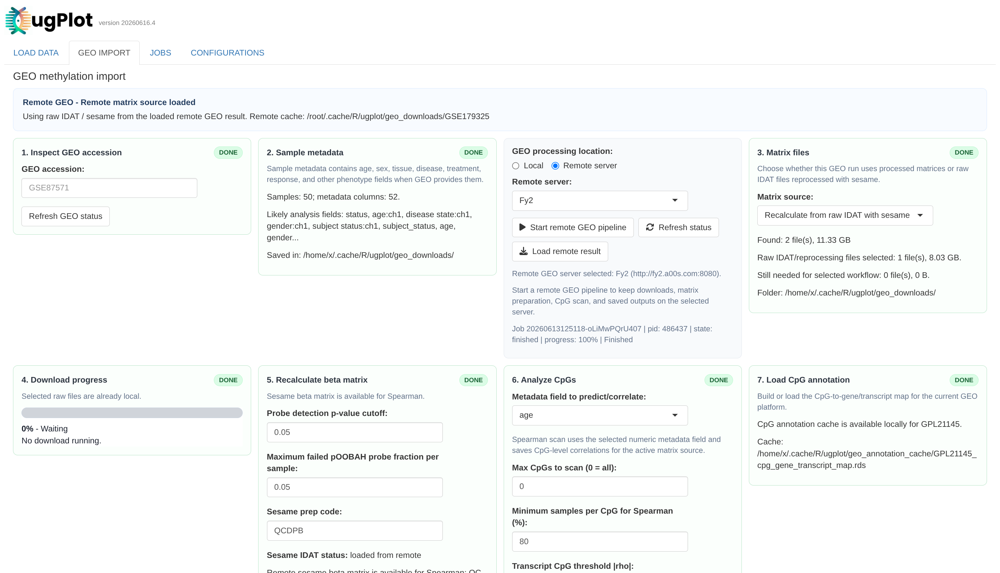

Use **GEO IMPORT** when you want ugPlot to inspect a GEO methylation accession, prepare CpG matrices, find CpGs correlated with a phenotype, build transcript-level candidate datasets, and run transcript ML models.

> **The core question: what changed between two classes?**
>
> The main goal of the GEO IMPORT transcript workflow is to compare a **reference class** against a **comparison class** in relation to a defined **predictable target**. The target is the variable the CpGs/transcripts are trying to explain or predict, such as age, disease severity, treatment response, vitamin intake, exposure level, or another measurable phenotype. Once that target exists, the key question becomes: which transcript groups, CpGs, and ML signals changed between the selected classes?
>
> Examples include predicting age and then comparing younger vs older groups, predicting disease severity and comparing control vs cancer, predicting response and comparing untreated vs treated, or predicting intake/exposure and comparing low vs high intake. ugPlot first finds CpGs associated with the selected target, groups them by transcript, trains transcript-level models, and then orders the selected classes by target-prediction performance. The reports then show which transcript groups move up or down between classes and which CpGs may explain that movement.
>
> Read the GEO results as a guided comparison, not just a collection of tables. The class ranking plot shows whether transcript order changes between groups. The largest-change tables identify the strongest transcript shifts. The selected-transcript reports explain whether the shift comes from methylation differences, ML prediction differences, or both. The CpG-level tables help narrow the transcript signal to specific probes that can be checked biologically.

This page is organized as a numbered pipeline. Green **DONE** cards mean ugPlot found the required local or remote output for that step. Yellow **PENDING** means the step still needs to run, be loaded from a remote result, or be refreshed after changing a parameter.

The GEO workflow is intentionally stricter than loading a normal CSV because public methylation datasets mix raw files, processed matrices, platform annotation, phenotype metadata, missing probes, and large ML outputs. If a later report looks empty, first check which numbered card is still pending or which threshold removed all candidates.

### 9.1 Choose local or remote processing

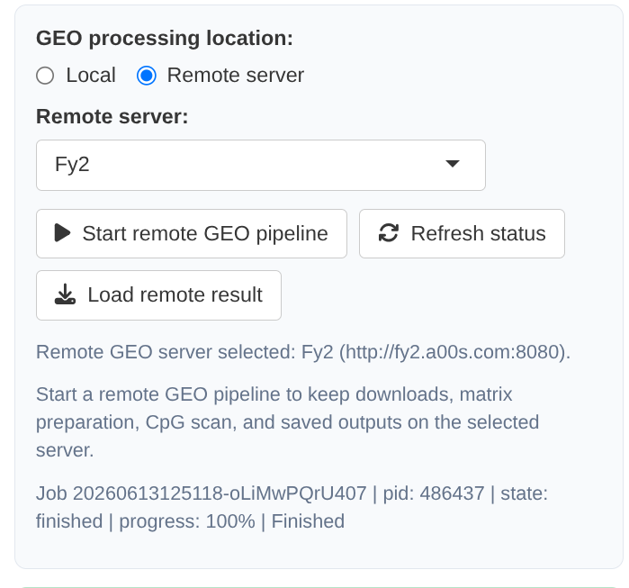

The **GEO processing location** panel controls where the expensive work runs.

- **Local** runs the GEO pipeline inside the current Shiny/R session.
- **Remote server** sends the pipeline to a configured ugPlot server, keeps large artifacts on that server, and lets you load the lightweight result back into the interface.
- **Start remote GEO pipeline** submits a new remote run using the current accession and settings.
- **Refresh status** checks whether the selected remote job is still running, failed, or finished.
- **Load remote result** imports the finished remote result into the GEO IMPORT tab.

When a remote result is loaded, the blue status banner shows the active remote matrix source and remote cache path. This means downstream GEO tables and transcript ML summaries are being read from the loaded remote job metadata, while large matrices can remain on the server.

For small processed matrices, local mode can be enough. For raw IDAT/sesame or transcript ML screening, prefer remote mode because the job can take hours and produce large artifacts. In that setup, the browser session is only a viewer/controller; the authoritative cache remains on the remote server.

### 9.2 Step 1 — Inspect GEO accession

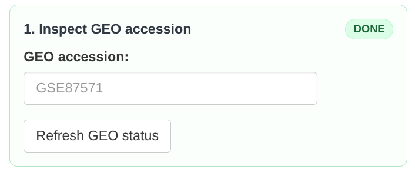

Enter a GEO accession, for example `GSE87571`, and click **Inspect files** or **Refresh GEO status**.

This step checks the GEO record and supplementary files. If it succeeds, the accession card turns **DONE** and the app can plan which matrix or raw IDAT files are available.

At this point you are checking whether the accession is technically usable, not interpreting biology yet. A good accession for this workflow should have enough samples, methylation-compatible files, at least one metadata field that can serve as the prediction/correlation target, and optionally another metadata field that can define comparison classes.

### 9.3 Step 2 — Review sample metadata

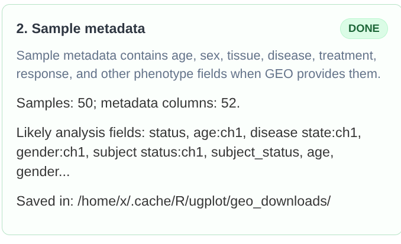

The **Sample metadata** card summarizes the phenotype table extracted from GEO.

Check:

- total sample count,
- number of metadata columns,
- likely analysis fields such as `age`, `status`, `disease state:ch1`, `gender:ch1`, or `subject_status`,
- the local cache folder used by ugPlot.

These metadata fields are the candidates for two different roles: the target/correlation variable used later in Step 6, and the class/group variable used in Step 10 to compare how the target-prediction signal changes between groups.

Choose metadata fields deliberately. Numeric fields such as age, dose, intake, exposure, or severity scores work well as the target for Spearman scans and ML prediction. Categorical fields such as disease state, responder group, treatment group, or severity class are useful later as comparison classes. Avoid fields with too many unique values, inconsistent text labels, or severe class imbalance unless you clean or collapse them first.

### 9.4 Step 3 — Choose matrix files

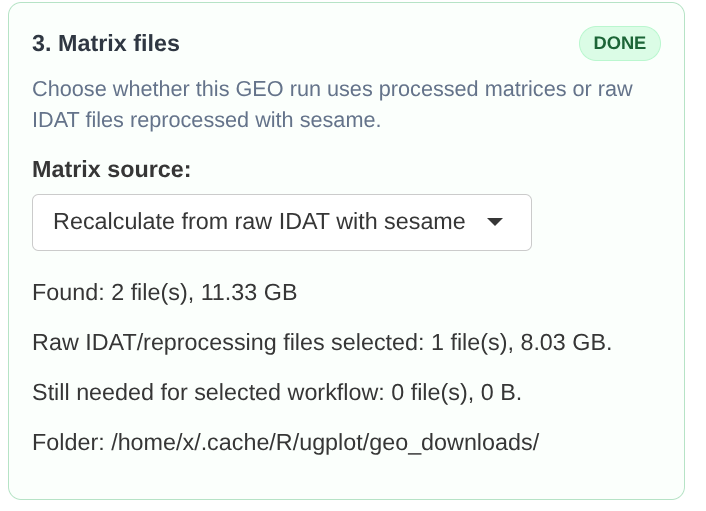

In **Matrix files**, choose the matrix source:

- **Use GEO processed matrix** when GEO already provides a usable beta/intensity table.
- **Recalculate from raw IDAT with sesame** when you want ugPlot to use raw IDAT files and create a sesame beta matrix.

The card reports how many files were found, how much disk space they use, which files are needed for the selected workflow, and the cache folder. If **Still needed** is `0 file(s)`, ugPlot already has the required files for the selected source.

Processed matrices are faster and usually enough for exploratory analysis. Raw IDAT with sesame is slower but gives a more controlled preprocessing path and QC report. Use raw IDAT when reproducibility of methylation preprocessing matters or when the processed GEO matrix is not suitable for the question.

### 9.5 Step 4 — Download progress

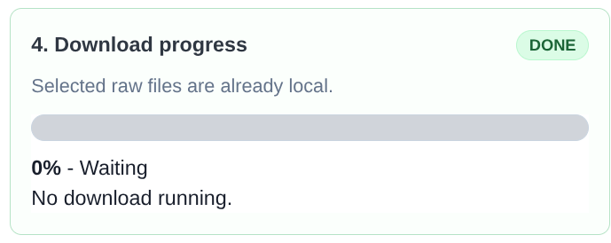

This card tracks GEO file acquisition.

For remote jobs, downloads happen on the selected remote server. For local jobs, this card reports local download/extraction status. If it says the selected files are already local, you can continue without downloading again.

### 9.6 Step 5 — Recalculate beta matrix

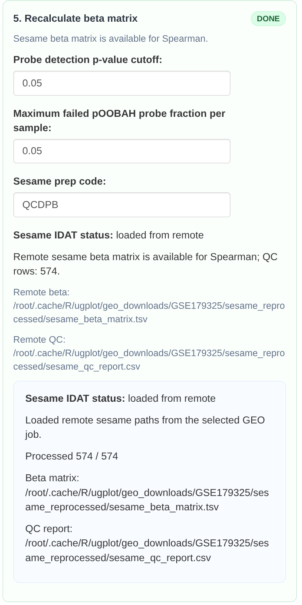

When using raw IDAT files, Step 5 runs sesame QC/reprocessing and creates the beta matrix used by Spearman analysis.

Key settings:

- **Probe detection p-value cutoff**: default `0.05`.
- **Maximum failed pOOBAH probe fraction per sample**: default `0.05`.
- **Sesame prep code**: default `QCDPB`.

When loaded from a remote run, this card shows the remote beta matrix path, QC report path, and number of processed QC rows. If the beta matrix is available, Step 6 can scan CpGs without rerunning sesame.

### 9.7 Step 6 — Analyze CpGs

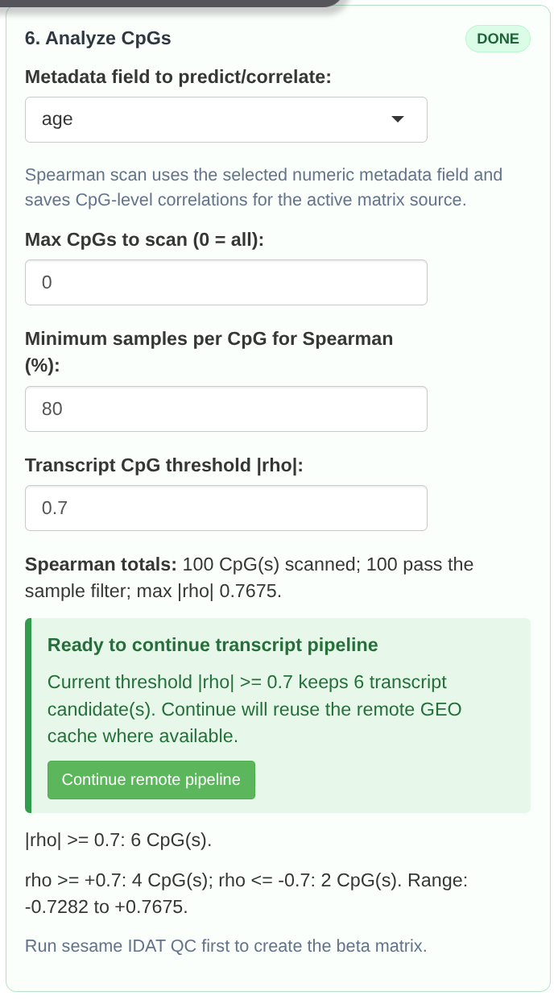

Step 6 computes CpG-level Spearman correlations against the selected numeric metadata field.

Key settings:

- **Metadata field to predict/correlate**: the target phenotype variable, such as `age`, severity score, dose, intake, or another numeric measurement.
- **Max CpGs to scan**: use `0` to scan all available CpGs.
- **Minimum samples per CpG for Spearman (%)**: minimum complete samples required per CpG.
- **Transcript CpG threshold |rho|**: minimum absolute Spearman correlation used to keep transcript candidates.

The summary reports how many CpGs were scanned, how many passed the sample filter, and the observed maximum `|rho|`. If the current threshold keeps transcript candidates, the green **Ready to continue transcript pipeline** box appears. If no candidate passes the threshold, lower the threshold or change the target field before continuing.

The transcript threshold is a discovery filter, not a biological truth cutoff. A high value such as `0.8` is strict and may produce no candidates. A value around `0.7` is often a useful first pass for testing the full pipeline. If you lower the threshold, expect more transcript groups and longer ML runs; use the rank limit in Step 9 when you only want to test the workflow.

### 9.8 Step 7 — Load CpG annotation

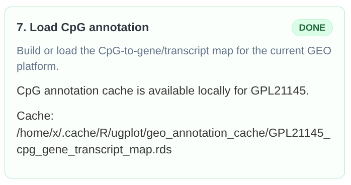

Step 7 loads or builds the CpG-to-gene/transcript annotation map for the GEO platform.

The card shows the detected platform, for example `GPL21145`, and the annotation cache path. This annotation is required before ugPlot can group CpGs by transcript and build transcript ML datasets.

### 9.9 Step 8 — Build transcript ML datasets

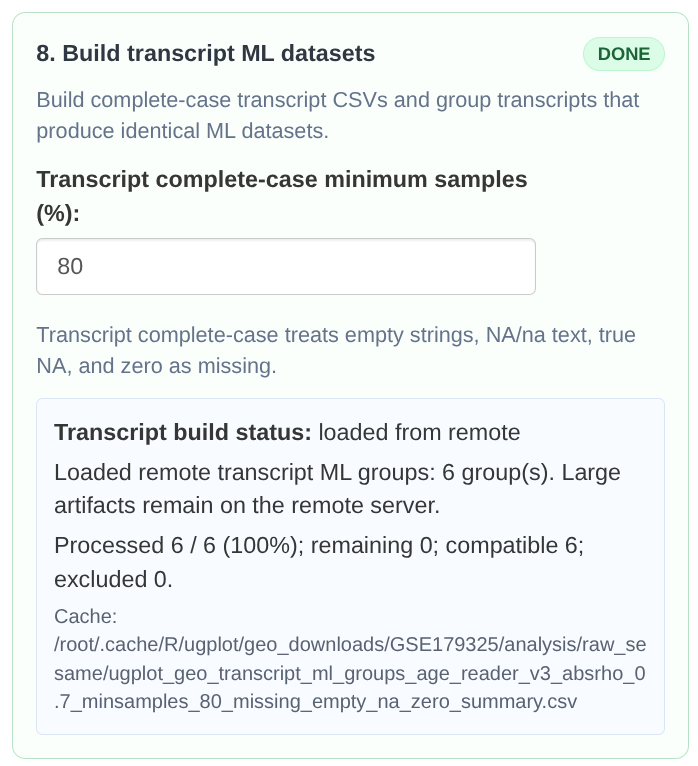

Step 8 creates complete-case transcript datasets from the CpGs that passed Step 6 and the annotation from Step 7.

Key setting:

- **Transcript complete-case minimum samples (%)**: minimum sample retention required for a transcript dataset, default `80`.

ugPlot treats empty strings, `NA`/`na` text, true `NA`, and zero as missing for this transcript complete-case step. Transcripts that produce identical final CpG/sample datasets are grouped together to avoid repeated ML runs.

The status box reports processed groups, compatible groups, excluded groups, and the cached group summary path.

This grouping is important. Multiple transcripts can share the same retained CpGs and samples, so running ML separately for each would repeat the same computation. ugPlot keeps a representative transcript and records compatible transcripts so the result remains traceable without wasting compute.

### 9.10 Step 9 — Screen transcript ML models

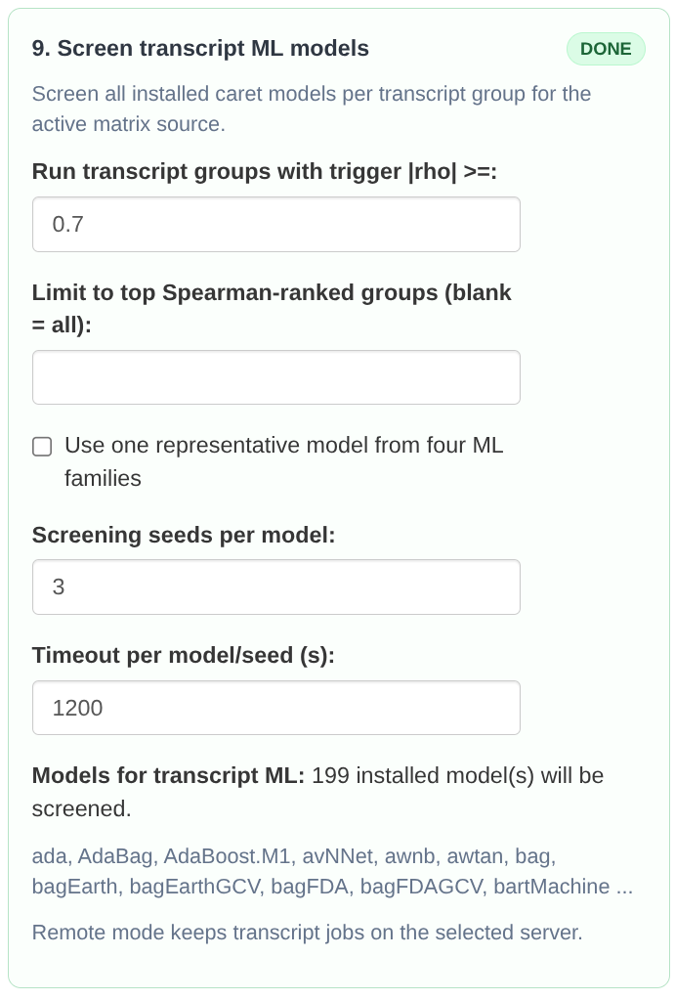

Step 9 screens installed caret models for each transcript candidate group.

Key settings:

- **Run transcript groups with trigger |rho| >=**: only runs groups whose strongest CpG correlation reaches this threshold.
- **Limit to top Spearman-ranked groups**: optional cap for quick testing.
- **Use one representative model from four ML families**: faster exploratory mode.
- **Screening seeds per model**: number of seeds used while screening.
- **Timeout per model/seed (s)**: maximum training time for each model/seed attempt.

The model summary shows how many caret models are installed and will be screened. In remote mode, these jobs stay on the selected server until a result is loaded.

Use Step 9 to find plausible model families, not to make final claims. If you are still debugging an accession, restrict to the top Spearman groups or use the representative-model option. Once the workflow is correct, run the broader model screen and let Step 10 stabilize the best candidates.

### 9.11 Step 10 — Stabilize best transcript ML

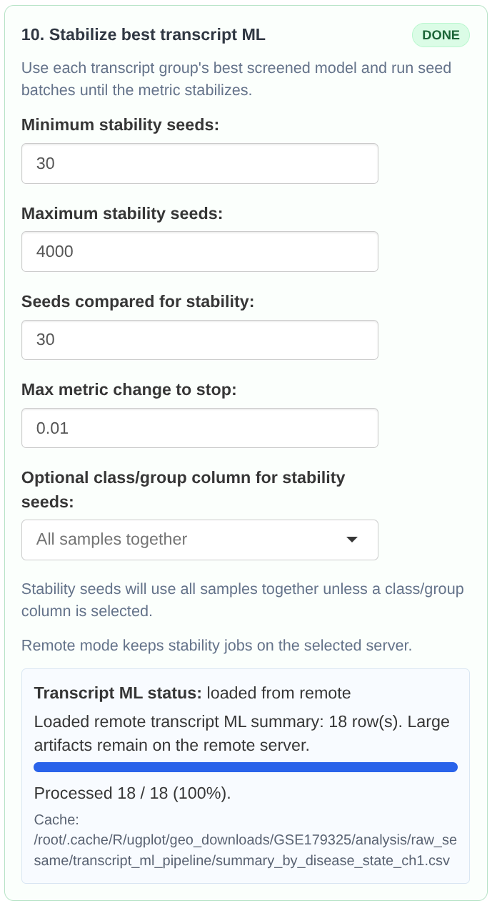

Step 10 takes the best screened model for each transcript group and reruns seed batches until the metric stabilizes.

Key settings:

- **Minimum stability seeds**: minimum number of seeds before stopping can be considered.
- **Maximum stability seeds**: hard upper limit.
- **Seeds compared for stability**: rolling window used to compare metric changes.
- **Max metric change to stop**: tolerance for considering the metric stable.
- **Optional class/group column for stability seeds**: runs class-aware stability summaries, useful for comparing transcript behavior across phenotype classes.

When complete, the status box reports how many transcript ML summary rows were loaded and where the final summary CSV is cached. Use the transcript ML results tables below the pipeline cards to inspect class rankings, transcript changes between selected classes, CpG-level changes, and ML importance plots.

The optional class/group column changes the meaning of Step 10. Without it, stability is evaluated across all samples together. With it, ugPlot can summarize whether a transcript model predicts the same target differently across classes such as control, mild, severe, responder, or non-responder. Use this when the biological question is not only "what predicts the target?", but "does that target-prediction behavior shift between groups?"

### 9.12 Recommended GEO workflow

1. Enter the GEO accession and refresh Step 1.
2. Confirm sample metadata and choose the target field you want to predict/correlate, such as age, severity, response, dose, or intake.
3. Choose processed matrix or raw IDAT/sesame as the matrix source.
4. Run locally only for small jobs; use a remote server for large IDAT/sesame and transcript ML runs.
5. In Step 6, start with a practical `|rho|` threshold such as `0.7`, then lower it only if no transcript candidates appear.
6. Build transcript ML datasets in Step 8.
7. Screen models in Step 9.
8. Stabilize the best models in Step 10, optionally using a disease/status class column.
9. Open the transcript ML results section to compare transcript ranking changes across classes and inspect the CpGs driving those changes.

For a first development run, do not optimize every setting. Run the pipeline with a small candidate set, confirm that reports load, then expand the candidate count and model set. This avoids spending a day on a remote run before discovering that the chosen metadata field or class column was not the one you wanted.

### 9.13 GEO report tables and plots

After the pipeline cards, **GEO IMPORT** exposes collapsible report sections. These reports are meant to answer three questions:

1. Which samples, files, CpGs, and transcripts entered the analysis?
2. Which transcript groups are strongest overall?
3. Which transcript groups and CpGs change most between selected classes?

#### Sample metadata table

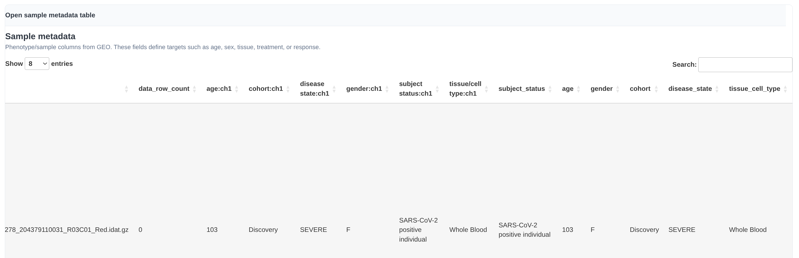

This table shows the parsed phenotype/sample metadata from GEO. Use it to confirm that the accession contains both the variable you want to predict/correlate and the class labels you want to compare. For example, `age` can be the target, while disease state can be the class column.

Important uses:

- choose the numeric target field for CpG Spearman analysis, such as `age`, severity score, dose, or intake,
- choose a class/group column for Step 10 stability summaries and class comparisons,
- verify sample counts and class labels before interpreting ML results.

#### GEO files table

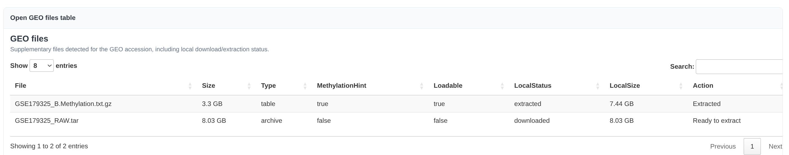

This table lists supplementary GEO files and their local/remote status.

Key columns:

- **File**: GEO supplementary file name.
- **Type**: table, archive, IDAT bundle, or other detected file type.
- **MethylationHint**: whether the file looks relevant for methylation.
- **Loadable**: whether ugPlot can load the file directly as a table.
- **LocalStatus** and **LocalSize**: download/extraction state and local cache size.
- **Action**: next useful action, such as extracted or ready to extract.

Use this table to confirm that the selected matrix source really has the files it needs.

#### CpG Spearman table

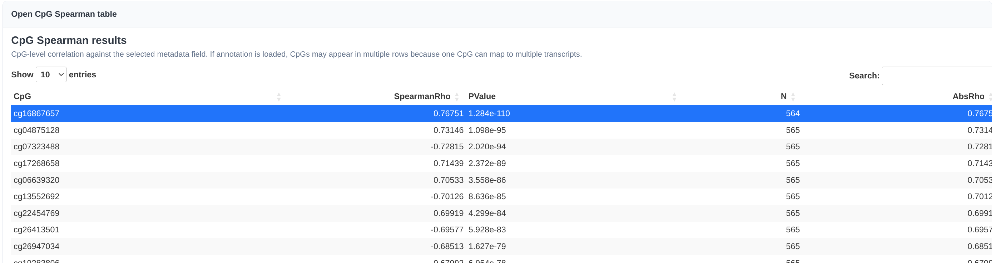

This table ranks CpGs by correlation with the selected metadata field from Step 6.

Key columns:

- **CpG**: probe identifier.
- **SpearmanRho**: signed Spearman correlation with the target field.
- **PValue**: correlation p-value.
- **N**: complete sample count used for that CpG.
- **AbsRho**: absolute correlation, useful for thresholding.

If annotation is already loaded, one CpG can appear in multiple rows because the same CpG may map to multiple transcripts.

#### Transcript ML candidate groups

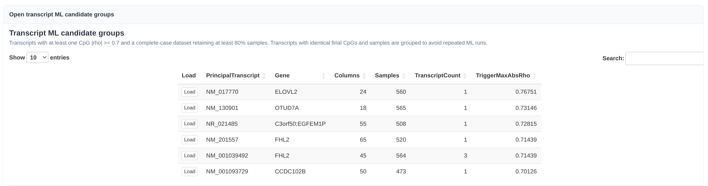

This table lists transcript candidate groups created in Step 8. A group can represent one transcript or several compatible transcripts that produce the same final CpG/sample dataset.

Key columns:

- **Load**: loads that transcript-group dataset into the main ugPlot data workflow.
- **PrincipalTranscript** and **Gene**: representative transcript and gene.
- **Columns**: number of CpGs/features retained.
- **Samples**: complete-case samples retained.
- **TranscriptCount**: number of compatible transcripts in the group.
- **TriggerMaxAbsRho**: strongest absolute Spearman correlation that triggered the group.

Select a row to inspect the CpGs and genomic context for that transcript group.

#### Transcript genomic track

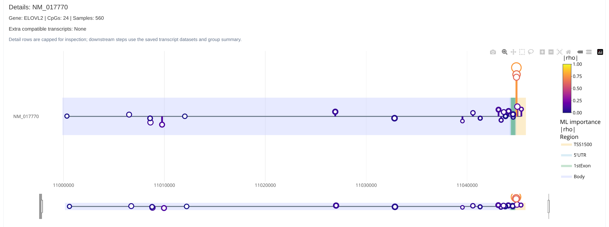

The transcript track shows where the group CpGs fall across genomic position and transcript regions.

How to read it:

- dots are CpGs,
- color/height highlight Spearman `|rho|` and, when available, ML importance,
- shaded regions represent transcript/gene regions such as body, UTR, exon, or TSS windows,
- clustered high-signal CpGs near a regulatory region are often more interpretable than isolated points.

Use this plot to see whether the strongest CpGs are concentrated in promoter/TSS regions, gene body, UTRs, or exon regions.

#### Transcript CpG detail table

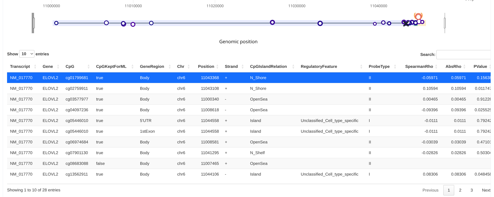

This table gives CpG-level details for the selected transcript group.

Important columns:

- **CpGKeptForML**: whether the CpG was retained in the final ML dataset.
- **GeneRegion**, **Chr**, **Position**, **Strand**: genomic annotation.
- **CpGIslandRelation**, **RegulatoryFeature**, **ProbeType**: platform annotation context.
- **SpearmanRho**, **AbsRho**, **PValue**: association with the selected metadata field.

Use this table when you need exact CpG IDs and coordinates for downstream validation or external annotation.

#### Transcript class ranking plot

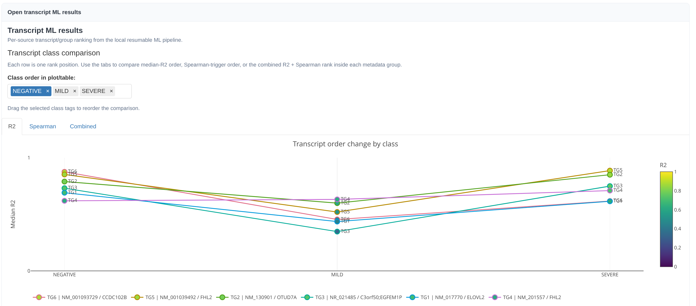

This plot compares transcript group ranking across selected classes for the already chosen prediction target. The class tags at the top define the order shown on the x-axis and can be reordered by the user.

Tabs change the ranking rule:

- **R2** ranks by class-specific ML prediction performance.
- **Spearman** ranks by the strongest transcript-triggering CpG correlation.
- **Combined** blends ML performance and Spearman rank.

Each line is a transcript group. Large vertical movement between classes means the group changes rank strongly between those classes.

#### Transcript class ranking table

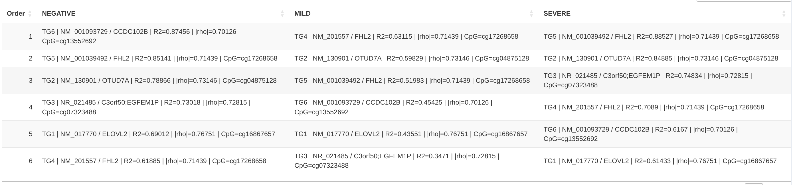

This table is the numeric version of the class ranking plot. Each column is a selected class; each row is a rank position. The cell shows the group, transcript/gene, metric value, trigger `|rho|`, and trigger CpG.

Use it when the plot is crowded and you need the exact order per class.

#### Largest transcript changes

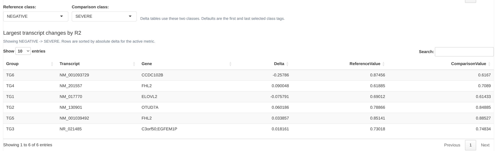

This table focuses on the selected reference and comparison classes. By default, ugPlot uses the first and last selected class tags, but the dropdowns let you choose any pair.

Key columns:

- **Group**: transcript group ID.
- **Transcript** and **Gene**: representative transcript and gene.
- **Delta**: comparison value minus reference value for the active metric.
- **ReferenceValue** and **ComparisonValue**: metric values in each selected class.

Rows are sorted by absolute delta, so the top rows are the strongest class-dependent transcript changes for the active tab.

#### Selected transcript class comparison

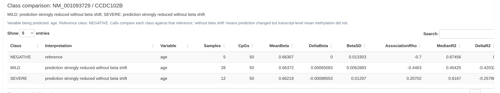

After selecting a transcript group, this table summarizes class-level behavior for that group.

It reports:

- class label and interpretation,
- sample count,
- number of CpGs,
- mean transcript beta,
- beta shift against the reference class,
- association rho,
- median R2 and R2 change.

This is the main report for deciding whether the transcript changes because methylation changed, ML prediction changed, or both.

#### Top CpG changes inside selected transcript

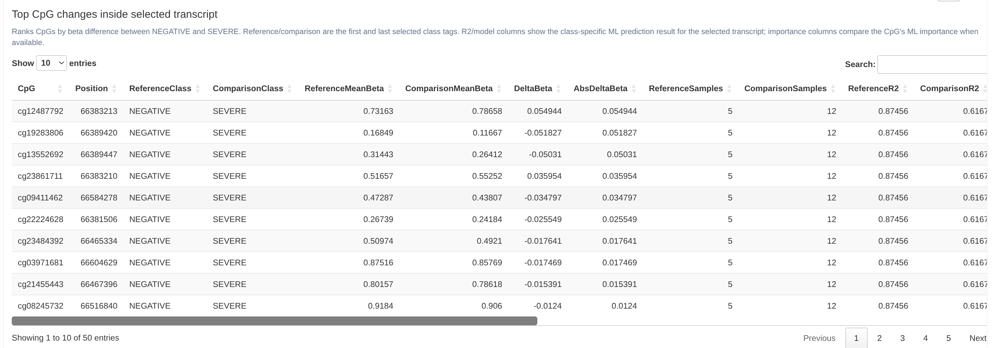

This table ranks CpGs inside the selected transcript by beta difference between the reference and comparison classes.

Important columns:

- **ReferenceMeanBeta** and **ComparisonMeanBeta**: class-specific methylation means.
- **DeltaBeta** and **AbsDeltaBeta**: signed and absolute methylation shift.
- **ReferenceSamples** and **ComparisonSamples**: complete sample counts.
- **ReferenceR2** and **ComparisonR2**: transcript-level class-specific ML result.
- importance columns, when present, compare ML importance for the same CpG across classes.

Use this table to identify which CpGs are driving the class-level transcript shift.

#### Spearman vs ML importance agreement

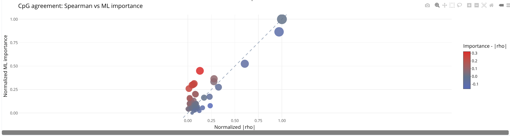

This plot compares normalized Spearman `|rho|` with normalized ML importance for CpGs in the selected transcript group.

How to interpret it:

- points near the diagonal are CpGs supported similarly by correlation and ML importance,
- high ML importance with low `|rho|` may indicate a non-linear or model-specific signal,
- high `|rho|` with low ML importance may be redundant once other CpGs are present,
- color shows the difference between ML importance and Spearman signal.

Use this plot after selecting a transcript group to decide whether the model is relying on the same CpGs that drove the Spearman candidate selection.

---

## 10) SCIENCE COLLAB — contribute CPU to a live experiment

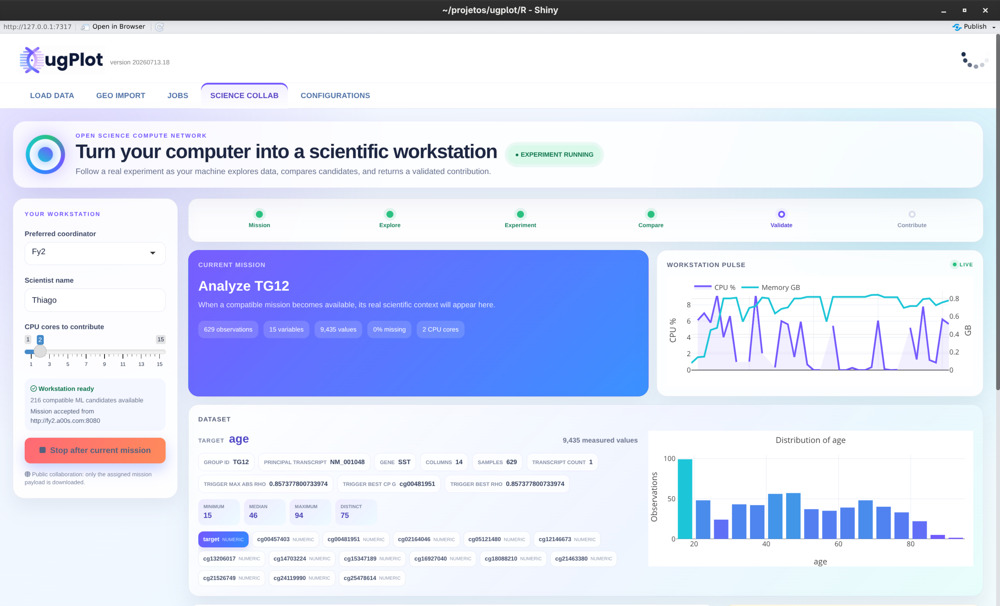

Use **SCIENCE COLLAB** to lend part of your computer's processing power to an experiment already running on an ugPlot server. While your computer helps, the page turns the work into a visual scientific journey: it shows the dataset, the current experiment, live results, and the contribution you made.

### 10.1 When to use Science Collab

Science Collab is most useful when a long analysis is in progress and additional computers can help finish it sooner. It is not necessary for a small local analysis or for viewing a job that has already finished.

### 10.2 Before you start

- Add the server in **CONFIGURATIONS**.
- Make sure that server has an active collaborative job.
- Choose a number of CPU cores that still leaves your computer comfortable to use.
- Keep the ugPlot window open while contributing.

### 10.3 Start contributing

1. Open **SCIENCE COLLAB**.
2. Choose the **Preferred coordinator**.
3. Enter the name you want to display as the contributing scientist.
4. Choose how many **CPU cores to contribute**.
5. Check the readiness message. If no mission is available, ugPlot explains what is missing or why the workstation cannot join yet.
6. Click **Start contributing**.

ugPlot may wait briefly for a suitable mission. Once one is received, the scientific panels begin to fill automatically.

### 10.4 What you will see

The page updates automatically as the mission advances:

- **Scientific journey** shows the current stage, from receiving the mission to delivering the contribution.
- **Current mission** identifies the group being studied and summarizes its samples, variables, values, missing data, and CPU allocation.
- **Workstation pulse** shows live CPU and memory use. High CPU during an experiment is normal.
- **Dataset** presents the target, variables, gene or transcript information when available, and the target distribution.
- **Experiment arena** compares the models already tested and follows the model currently running.
- **Discovery emerging** highlights the strongest result found so far.
- **Your scientific impact** counts completed experiments, accepted contributions, and donated computing time during the session.

### 10.5 Understanding the results

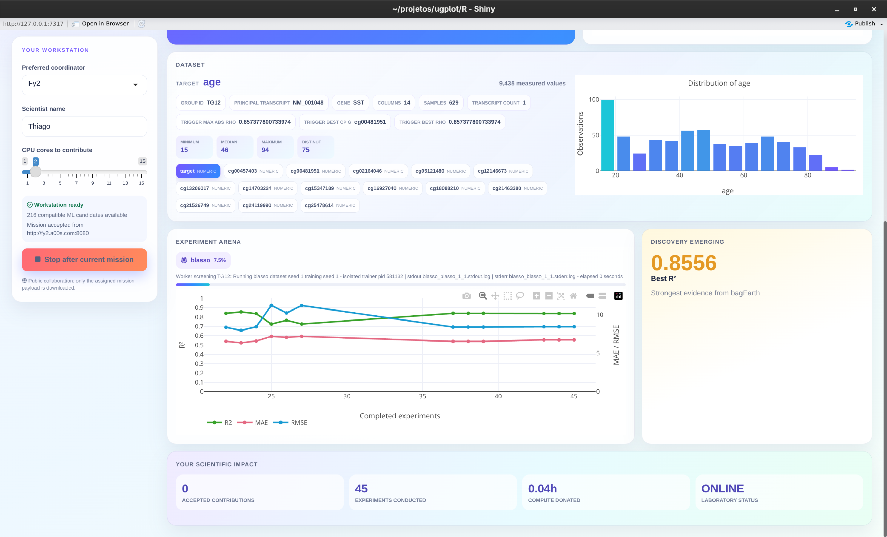

In **EXPERIMENT ARENA**, each point represents a completed model experiment:

- **R²** is the main quality measure: higher values indicate better predictive performance.
- **MAE** and **RMSE** measure prediction error: lower values are better.
- Hover over a point to see the model and its exact result.

The highlighted result is the best result found so far, not a final biological conclusion. Interpret it together with the sample size, target distribution, consistency across experiments, and the final reports produced by the main job.

### 10.6 Stop contributing

Click **Stop after current mission** when you no longer want to receive new work. ugPlot finishes the current mission when possible and then stops. Closing the contributor does not erase the main job or make its completed groups start over.

### 10.7 If no mission starts

Read the message below **Workstation ready**. It normally tells you whether there is no active work, the server is unreachable, ugPlot needs an update, or a required model is unavailable. Correct the indicated item and click **Start contributing** again.

### 10.8 Data privacy

Use public collaboration only with data that may be shared with contributing computers. For confidential, identifiable, embargoed, or access-controlled data, keep collaboration inside a trusted private network or leave it disabled.

---

## Suggested end-to-end workflow (quick checklist)

1. Install with Podman image (recommended).
2. Load file and verify separator/start line.
3. Clean rows/columns in TABLE.
4. Explore patterns in HEATMAP and 2D tabs.
5. Configure missing data strategy carefully.
6. Install missing libraries (Check all → Install libraries).
7. Train multiple models and compare metrics.
8. Optionally refine results with DEEP LEARNING (`torch`) and inspect network diagnostics.
9. Use GRAPH MODELS to inspect feature networks and export edge/node tables.
10. Validate final `.rds` model in MODEL ANALYSIS.
11. Export processed dataset and analysis tables.
12. For long active GEO transcript screens, use SCIENCE COLLAB to distribute compatible pending groups across additional workstations.
